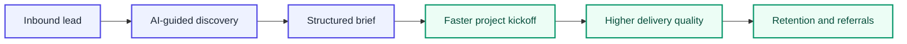
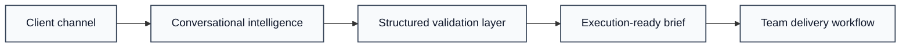

---

## What we build

> **Structed AI eliminates the hours spent extracting requirements from client calls.**
> Our AI agent runs structured interviews, captures everything that matters, and delivers a ready brief automatically.

Agencies and freelancers spend **3-4 hours per project** on discovery: chasing answers, filling forms, decoding vague feedback. Structed replaces that with an AI-guided interview that runs itself and outputs a complete, actionable brief.

**97% extraction accuracy. Zero manual work.**

---

## The problem we solve

<table>
<tr>
<td width="50%" valign="top">

**Before Structed**

- Scattered notes from multiple calls
- Client forgets key requirements
- Hours spent writing briefs manually
- Misunderstandings discovered mid-project
- 4 hours lost on discovery, every time

</td>
<td width="50%" valign="top">

**After Structed**

- AI conducts the client interview
- Requirements captured in real time
- Structured brief generated automatically
- Clarity before work begins
- Discovery done in 20 minutes

</td>
</tr>
</table>

---

## Product flow

---

## Architecture

Structed combines conversational AI with a structured intake pipeline to transform unstructured client input into consistent, execution-ready briefs.

---

## Growth engine

---

## Technology

- AI-native product architecture built for rapid iteration and measurable quality
- Modular platform design that scales across use cases, team sizes, and geographies
- Production-grade infrastructure with reliability and operational discipline
- Security and compliance by design, aligned with agency and SMB expectations
- Human-in-the-loop quality controls to keep output accurate and business-ready

---

## Who it's for

|  | Small agencies | Independent consultants | Freelancers |
|---|---|---|---|
| Team size | 3-10 people | Solo or small team | Solo |
| Pain | Client briefs always incomplete | Discovery calls eat the calendar | Can't afford back-and-forth |
| Value | Consistent briefs across all projects | Structured intake without the admin | Professional onboarding from day one |

---

## Traction

| Metric | Value |
|---|---|
| AI extraction accuracy | **97%** |
| Prototype rating (user feedback) | **8.5 / 10** |
| Organic visitors / month | **300-500** |
| Pipeline customers | **~16** |
| MVP completion | **~80%** |

---

## Pricing

|  | Freelancers | Agencies |
|---|---|---|
| Price | $110 / year | $150 / month |
| Interviews | Unlimited | Unlimited |
| Projects | Yes | Yes |
| Auto-generated briefs | Yes | Yes |
| Team seats | - | Yes |

---

## Team

**Structed AI Ltd** - incorporated in the United Kingdom, August 2025.  
Stage: Pre-seed. Raising SEIS round.

| | Role | Contact |
|---|---|---|
| **Marina Shmayger** | CEO - product, GTM, fundraising |   |
| **Denys Korolkov** | CTO - platform and AI |  |

---

